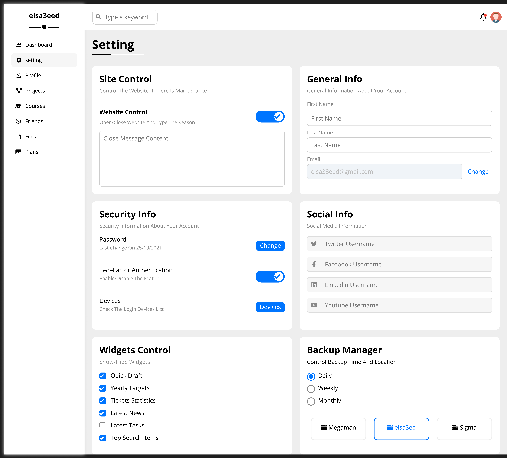

<h1>Dashboard</h1>

<h2>About the project</h2>

  
A <b>Dashboard</b> is an information management tool that receives data from a linked database to provide data visualizations. Dashboards provide users from all different businesses the ability to monitor performance, create reports, and set estimates and targets for the future.

👉 Live Demo: <a href='https://dashboard-elsa33eed.vercel.app/'>Live Demo</a>

<h3>Build with:</h3>

» HTML  
» Css (MY Framework)

<h2>Screenshots of the Project 📸</h2>
 
<h3 align='center'>Home Page 🏡</h3>

<h3 align='center'>Setting Page 🏡</h3>

